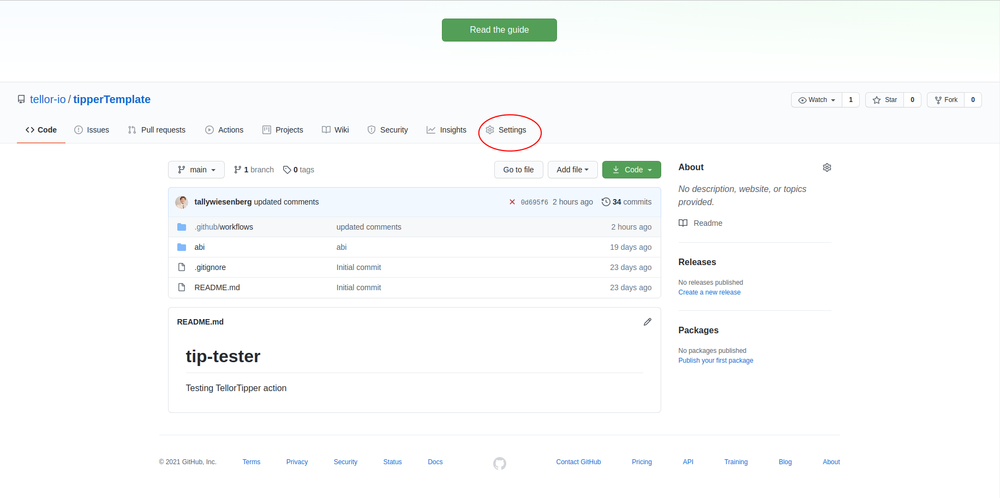
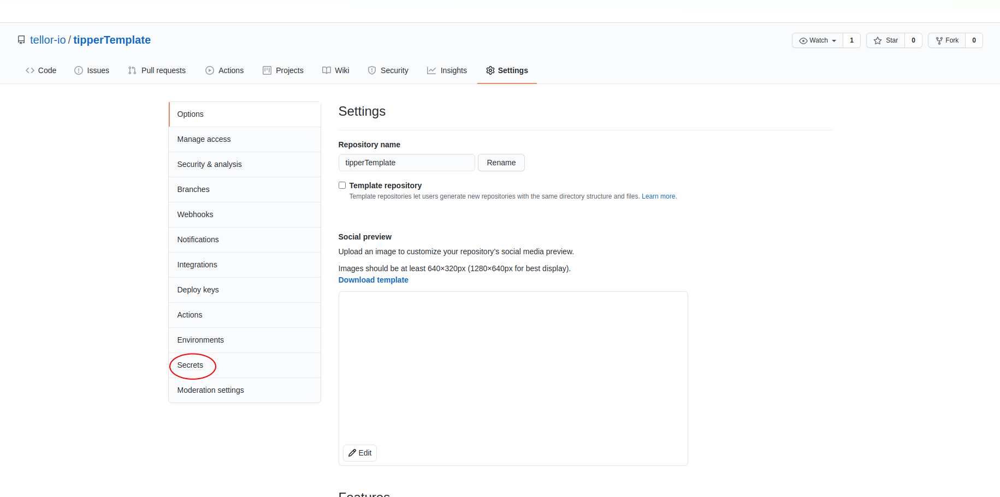
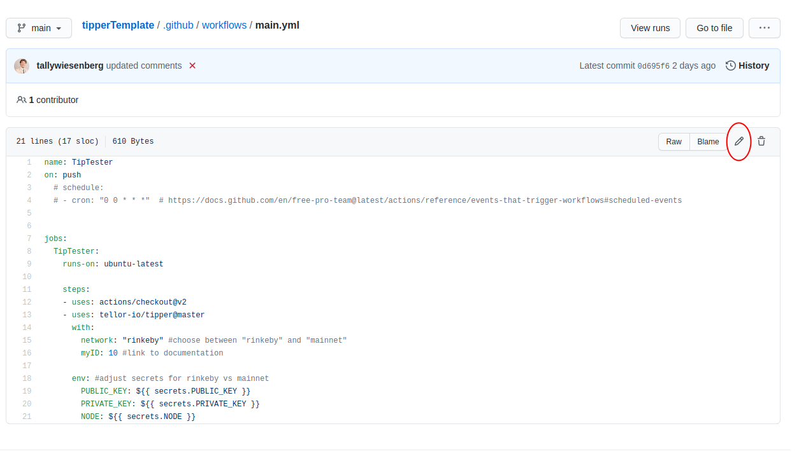

# Tellor TipperTemplate

## What can I use this for?
You can use this tool to request new on-chain Tellor oracle data, all without leaving github!

To get started, you will need to use this template, add some secrets to your repo, and edit the provided workflow.

## Using the template
1. Click the green "use this template" button. 
2. Navigate to repo settings. 
3. Navigate to repo secrets. 
4. Add the necessary repo secrets. 

## What secrets will I need?
You can find the names of the github secrets to set on the `main.yml` file. Note: you will need to use these exact secrets titles verbatim.
* `PUBLIC_KEY` -- your account's public key
* `PRIVATE_KEY` -- your account's private key
* `MAINNET_NODE` -- your JSON-RPC mainnet endpoint. usually HTTP.
* `RINKEBY_NODE` -- your JSON-RPC rinkeby endpoint. ususally HTTP.

## How can I update the workflow from github?
1. Navigate to `main.yml` in the `.github/workflows` directory.
2. Edit `main.yml` 
3. On lines 15 and 16, fill in your preferred `network` and tip ID (`tipID`).
4. On line 4, update your cronjob preferences (how often you'll request Tellor oracle data) according to your needs. Cronjob documentation is provided in the comments!
5. Commit changes!

## What are my choices for editing the workflow?
* `network` -- the ethereum network you'd like to connect with. Choose between "rinkeby" and "mainnet".
* `tipID` -- the data type you'd like to request (ex. 1 for ETH/USD). You can find the list of all current tip IDs [here](https://www.tellorscan.com/prices).
* `dataFreshness` -- this is your preferred amount of time since last request to this `tipID` on your chosen `network`. This variable uses two workflow variables. These are:
    * `freshnessTimeUnit` -- the unit of time you'd like to check for the most recent tip on your `requestID`. Ex: week, day, second, etc. For more information, visit https://day.js.org/docs/en/manipulate/add#list-of-all-available-units.
    * `freshnessTimeLength` -- the amount of your `freshnessTimeUnit` (ex. week, day, second, year) you'd like to check for.

    * Combined, these two workflow variables will save you TRB on unnecessary tips.