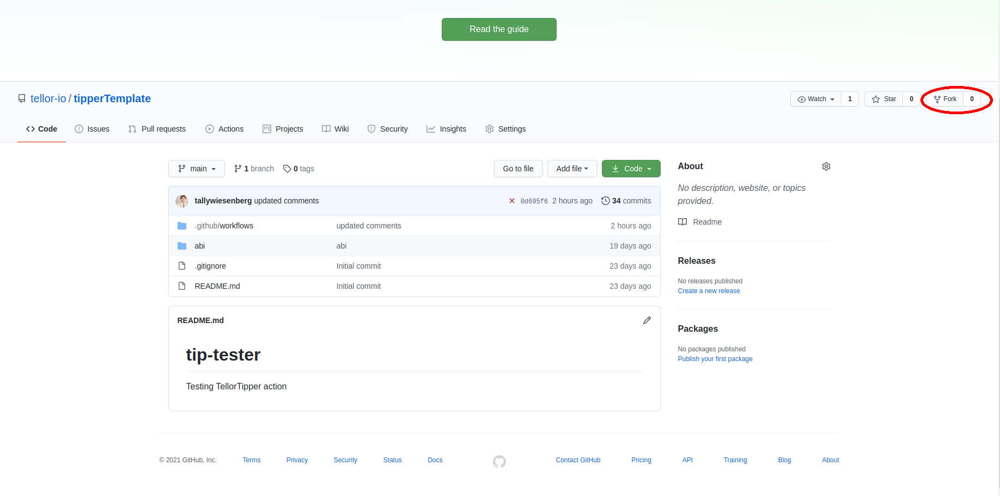

# Tellor TipperTemplate

## What can I use this for?
You can use this tool to request new on-chain Tellor oracle data, all without leaving github!

## How do I get started?
1. Fork this repo! 
2. Navigate to repo settings. 
3. Navigate to repo secrets. 
4. Add the necessary repo secrets. 
5. Update `network`, `tipID`, and `dataFreshness` in `.github/workflows/main.yml`

## What secrets will I need?
Note: you will need to use these exact secrets titles verbatim.
* `PUBLIC_KEY` -- your account's public key
* `PRIVATE_KEY` -- your account's private key
* `MAINNET_NODE` -- your JSON-RPC mainnet endpoint. usually HTTP.
* `RINKEBY_NODE` -- your JSON-RPC rinkeby endpoint. ususally HTTP.

## How can I update the workflow from github?
1. Navigate to `main.yml` in the `.github/workflows` directory.
2. Edit `main.yml` 
3. On lines 15 and 16, fill in your preferred `network` and tip ID (`tipID`).
4. On line 4, update your cronjob preferences (how often you'll request Tellor oracle data) according to your needs. Cronjob documentation is provided in the comments!
5. Commit changes!

## What are my choices for `network`, `tipID`, and `dataFreshness`?
* `network` -- the ethereum network you'd like to connect with. Choose between "rinkeby" and "mainnet".
* `tipID` -- the data type you'd like to request (ex. 1 for ETH/USD). You can find the list of all current tip IDs [here](https://www.tellorscan.com/prices).
* `dataFreshness` -- this is your preferred amount of time since last request to this `tipID` on your chosen `network`.